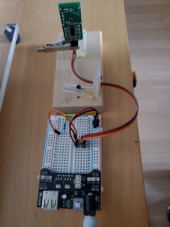
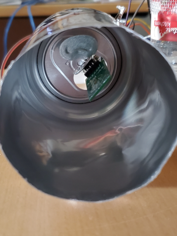
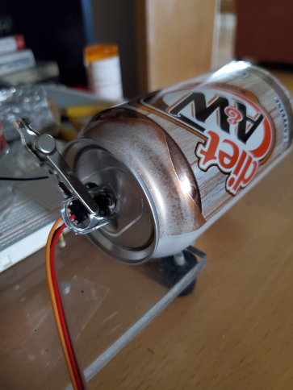
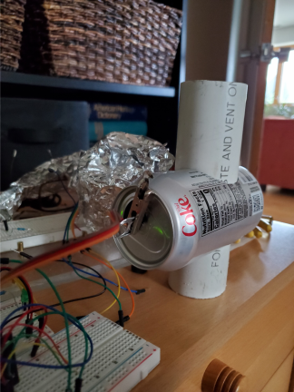

<b>Some Practical and Impractical Experiments with a RCWL-0516 Microwave
Radar Sensor Module</b>

Gary Dyrkacz

 

The original impetus for the experiments was to explore whether a
RCWL-0516 sensor module could be used to detect flowing water in a pipe,
particularly as a monitor for sump pump cycling. Total time the sump
pump was on was not a goal, only the cycling frequency. If tied to an
ESP32, data could easily be transferred via wifi to a Google Sheet for
presentation and archive. There are many different ways that such
monitoring could be accomplished, but I was intrigued by these small
sensitive sensors and decided to explore "taming" the sensor's range and
direction. As I proceeded a number of questions about range versus local
environment arose, and some outdoor observations were included.

Don't expect any sophisticated scientific analysis. These were simple
observations, based on a quick and dirty test set up. They offer some
insight, and maybe some thought for future considerations.

RCWL-0516 sensors detect motion of certain materials, including humans
and animals. The detection principle does not appear to strictly measure
a Doppler shift. I do not understand the component circuit details, but
there is a very good reference that attempts to explain the theory of
operation (Ref. 1).

 

The detection field is nearly spherical (Ref. 2). The modules can be
very sensitive depending on the type, size, and shape of the material in
motion, and likely general environment. A human can be detected out to
around 15 feet. In some cases, the omni-detection field is an advantage,
and in other cases, the lack of ability to focus the detection to a
specific area is a disadvantage. Using as a sensor for monitoring water
in a pipe would require a limited detection area.

 What I found was that the sensor,

1.  did have a very broad and long detection indoor range, but it can be
    tamed.

2.  was not applicable to a small water flow.

3.  could be turned into sort of a vibration sensor.

4.  could monitor a small change in the shape or size of a closed metal
    container

5.  was highly variable in detection outdoors, depending critically on
    where placed.

  

**Materials**

1.  CHENBO RCWL-0516 microwave radar sensor module. 

2.  AC to DC Class 2 converter adapter: , Input: 100-240V AC 0.4 A;
    Output: 9VDC, 1A.

3.  Elegoo breadboard power supply 6.5V-12V DC to 3.3V - 5V DC.

4.  Green LED.

5.  220 Ω resistor.

6.  Pop top soda cans.

 

**Circuit and Setup**

Two of the five RCWL-0516 modules in the set purchased were checked;
their long range characteristics were the same. However, all the tests
described here were with a single module. There was nothing special
about these modules relative to any other RCWL-0516 module, except the
price at the time, and positive reviews by other buyers.

Although I could have used an Arduino Uno to power and monitor the
module, I chose to use a breadboard power supply to convert the 9V DC
output of the AC to DC converter to 5V DC output. These power supplies
are readily available. (Both the power module and adapter were from an
Elegoo Arduino Uno R3 kit.) This combination provided a stable source of
5V power.

I used a simple circuit that I found on a Dronebot Workshop site (ref.
3). Here is the circuit diagram:

 

  

The 5V source is the breadboard power supply. A set of right angle male
header pins was soldered to the module. The LED served as the indicator
of detected motion.

**EXPERIMENTS**

There are a couple of general observations: The RCWL-0516 module
appeared to take ~10-15 s to "settle down" when turned on. At times the
sensitivity seemed to change, which may have to do with the orientation
of the alligator clip or minor changes in the module position in the
can.

To make sure the senor was working, the bare sensor with a Dupont
connector as the "support" was attached vertically to a small plastic
bracket using an alligator clip as shown below,

The plastic bracket was something I made to hold other modules. The
module easily picked up body or arm waving motions to a distance of
about 18 feet indoors in a large room.

The first real experiment was to check whether the aluminum can would
stop the microwaves. My concern was based on a comment online that the
wiring itself might be involved in picking up motion. The sensor was
attached to the pull tab of a standard aluminum soda pop can with an
alligator clip across the three pin Dupont connector and the can tab,
after flattening the flat round part of the tab inside the can. The
module easily fit in the can. See the picture below for how the module
was mounted in all cases.

After positioning the sensor in an uncut used can, no body movement far
or close was detectable. This proved the smooth aluminum can did
minimize any stray microwaves reflections back to the can, with some
optimism that some focused detection might be possible.

The next experiment was to see if the detection field could be directed.
The bottom of a pop can, was cut off using a Dremel cutoff wheel to
start a slit for tin snips to remove the bottom. The sensor was mounted
as already described. Below are two views of the setup:

This above view is looking into the can. You can see the bent back tab
inside.

The view above shows the simple method of attaching the sensor to the
can with the alligator clip. The only reason for using the clip was
convenience for quick changes.

Initial experiments with this set up were disappointing and confusing,
suggesting the microwaves were not being contained, contrary to the
closed can findings. When the can was pointed up with the opening
pointing to the ceiling or horizontally to the walls of a 10' x 11' the
room, It triggered on hand or on body movements at any distance, and any
movement around the can.

At one point, the horizontal can happened to be positioned with the
opening facing through a doorway ~5 ft away, into a room with a wall
some further 12' away. No movement of my body registered from the can
sides. Only when I put my hand or body directly in front of the opening
did the sensor trigger. Moving the can so it partially intercepted the
wall next to doorway, once again caused the sensor to trigger with body
movements when I was on the side of the can. As a further test, with the
can again pointing out the door, I put a round 3" metal cylinder
directly in front of the can opening and found any hand or body
movements near the side of the can would trigger the sensor.

When positioned through the doorway, small hand movements on the side of
the can did not trigger the sensor, only body movements. Unfortunately,
this observation could be described as *usually* repeatable. Sometimes,
possibly with slight variations in placement of the can, motions to the
side of the can were still detectable. At other times, the sensor seemed
to have its own opinion on when to register motion. I was not able to
satisfactorily deconvolute all these nuances of detection. Triggering
was definitely not because of random power fluctuations. No detection
occurred without some sort of rapid movement. However, when the can was
pointed to a wall within the room, motion detection was much more
consistent.

Curiously, squeezing the open end of the can to about a 1 inch slit with
a piece of painter's tape across the face. resulted in no detection at
all. Ii appears most of the micorwave output was retained in the can by
inward sloping walls.

I believe the sensor was picking up reflected waves off walls and
ceiling, even after they were reflected off my moving body. There did
not have to be direct line of sight to trigger the sensor in the
confines of the room. The closed can test shows that the smooth aluminum
can surface does not transmit the microwaves. The open ended can tests
suggested that wallboard (plasterboard), the paint on the walls (high
titanium dioxide content latex paint), or maybe both had a fairly high
microwave reflectivity. There may also be some level of absorption of
the microwave energy, but clearly there was enough reflection of the
microwaves to bounce around a room, and return to trigger the sensor.
With a fully exposed sensor mounted vertically (see last image below), a
typical 2x4 stud wall with two layers of 1/2" wallboard did not transmit
enough reflected energy from a human body to trigger the sensor from an
adjacent room. However, a wood hollow core door, hardly stopped the
microwave penetration. Even up to 18 feet, the sensor detected movement
in an adjacent room while standing directly in line with the door.

 

These initial experiment showed some promise for containing or
concentrating the beam around a section of standard schedule 40 2" PVC
pipe. So the question was how to tame the spherical detection field to
only a small region around the pipe. Would the PVC reflect waves or pass
through some distance up or down the PVC pipe, causing spurious
readings? I had initially tested a piece of PVC pipe over the sensor,
and found that the PVC was transparent to the microwaves.

 

I pursued the simplest idea as a first case A pop can is 2.5" in
diameter and my sump outlet pipe is 2" so there is some allowance for
completely wrapping the can around the pipe. The sensor sat about 2 3/4"
into the can, so just cutting out two 2" holes in a single can seemed
like a reasonable first option. I did not like the idea of the convex
bottom of the can, but there was no way to easily "reverse" the bottom,
other than removing and somehow reattaching it.

 

**Cutting the can to fit pipe**

Although I can no longer find the reference, I read online about
partially filling a can with water and freezing it to easily cut or
drill the can in intricate patterns. A pencil was used to mark out the
line, then a scribe to gently score a visible scratch line, without
denting the can. Of course, tracing on the sides of the can was
difficult, because of gap between end of flush cut PVC pipe and can. A
better solution would be to pre-shape the end of the PVC to better fit
the can. However, these were quick and dirty tests. The can was filled
about 80% of the way with water, and placed in a freezer. DO NOT
COMPLETELY FILL THE CAN WITH WATER, IT WILL SPLIT THE CAN. A utility
knife was then used to cut out the previously etched circles. The knife
was used to punch out the circles with small strokes, rather than clean
continuous slicing, because the blade was easier to control. (Straight
line slicing cuts are very easy to do with a utility knife.) The can was
held in a towel, which helped reduce thawing, and I worked as fast as I
safely could. The operation worked well. The results were two nice
circular holes. A short length of PVC pipe was inserted through the
holes. The fit was close enough that the can was rigidly held in place,
with no need tape or glue needed to secure the can to the pipe.

The final test assembly:

 

**Indoor Tests**

 The first test was without any probe, moving my hand or body near the
sensor to see if it would trigger the sensor. In no case, of rapid or
slow motion near or far from the assembly did the sensor trigger. So
despite my earlier issues with the semi-open can, the microwaves were
sufficiently contained.

 

The first test of sensitivity used a crumpling up piece all Al foil into
a "rod" ~5/8" in diameter, which was cycled up and down in the pipe
trying to keep it straight. I found that if I moved it slowly,
guesstimating at 1 in/s or slower, the sensor would not trigger. If I
moved the foil probe rapidly, like \> 6 in/s it would trigger. Even a
bare sensor does appear to be sensitive to the speed of motion.

 

However, I also found that if the "probe" touched the sides of the pipe
while plunging it in or withdrawing, the sensor would sometimes trigger.
Most likely this mode of triggering is due to the lazy way the module
was mounted, which allows for vibration of the sensor module. The module
appears to sense even this very small change in position due to the
vibration. Trying to gauge the trigger effect was tough when
continuously fighting this vibration sensitivity.

 

Remaining too lazy to build a rigid test platform for an experiment that
was not spectacularly promising, I used a piece of plastic rigid tube
with a ~3/8" ID that was handheld, to better control triggering with
different probes. I found the following results:

 

1.  There seems to be a "settling" time, between detections. Sometimes
    as long as 10 and 20 s, but the time was not consistent. The
    specifications of the module suggest a 2-3 s recycle time. At times,
    I found that to be true, but not always.

2.  Detection of a single fast event motion does not always trigger a
    response. Sometimes two or three fast motions are required. At least
    for small objects.

3.  A 1/4" solid plastic rod would not trigger the sensor at all, no
    matter what the entry or withdrawal speed, nor would a simple
    pencil, even using the eraser end. (Insufficient mass for
    reflection?)

4.  A 5/16" outside diameter hollow steel tube worked, but at entry
    rates over ~6in/s. This rod was from an old Coleman camping stove
    and had a brass hex nozzle at one end. Oddly, using the nozzle end
    as a probe was not as sensitive as the opposite end, which was
    threaded.

5.  A 1/8" chrome plated steel rod also showed sensitivity, at an entry
    and withdrawal rate of probably \>6in/s.

6.  There is likely a shape effect with respect to an object. For
    instance, the aluminum foil probe had one end approx. 1/2 the width
    of the other end. The smaller width was more readily detected. Of
    course, this is a highly irregular surface probe.

7.  There is a mass effect on sensitivity as well, which is going to
    depend on composition and density of the target.

 

Of course, in all cases, it is the probe motion that triggered a
response. If any of the probes were held steady in the pipe, no signal
appeared.

 

In all cases, with the exception of contact vibration, there were quite
a few inconsistencies in triggering. Sometimes, the sensor would act
very sensitive, and other times it seemed to drop sensitivity by an
order of magnitude, without any clear indication as to why.

 

As for the proposed goal to monitor water in the pipe, the entire test
assembly was handheld to suspend it and avoid vibration. Water from a
glass was poured in without touching the sides of the pipe. The water
did not trigger the sensor. These were tough tests to do, but repeated
testing showed the original idea of using radar to detect at least a
small amount of flowing water will not work. This is a bit surprising
consider a body can be detected. Of course, we have bone, organic
matrices and likely some electrical conductance due to salt content
compared to tap water. By comparison, body mass versus the maybe 30 mL
of water in the detection zone is a big difference.

 

The sensitivity of the assembly to vibration was interesting. I found
that while standing on the table top, even gentle finger tapping near
the assembly triggered the sensor. This behavior suggested one more
experiment. I mounted the sensor on an uncut can, again just using the
alligator clip. I placed the can on its base. As expected, any motion
far or near around the can did not generate a response. In this
configuration, tapping or even banging on the table produced no response
from the sensor. The same result was true, if the can was on its side.
However, in the vertical position, slightly deforming the side of the
can by just a few millimeters was enough to generate a consistent
response. Curiously, in principle the sensor would register water in the
pipe, because of the vibration effect on the sensor, but not due
directly to reflected microwaves by the water.

 

**Outdoor Tests**

To provide a bit more information on environmental conditions for
sensitivity, a few outdoor tests were conducted. There are no pictures
of the environments, because the results lack true generality, and were
critically dependent on the plants and local conditions. The cursory
description of the results should serve as a warning to expect extreme
range variations outdoors. The sensor was uncovered, positioned
vertically as indicated in the first image above. (I did try placing a
small bill bottle over the sensor in some early indoor experiments; it
did not affect the detection range. Most plastics will transmit the
microwaves.)

The experiments were done in the early morning with dew still on the
grass and shrubs, at a temperature of 54 degrees F. The detection range
of the sensor turned out to be surprising dependent on the environment.
Placed on a concrete driveway or patio, not near any landscape plants,
the range of the sensor to detect body movement was much like that
indoors, with a maximum detection range of 18 ft.

On a wet, freshly cut lawn, with the set up placed on the stepstool ~10
inches above the grass, the detection range again dropped off to less
than 4 feet.

When the stepstool was situated on a lava rock landscaping base, in an
area where shrubs surrounded the sensor within 12-16" , only swift hand
motion within 6 inches of the sensor was detected. No body motion was
detected past the plants.

If placed in a more open environment, but still near shrubs the results
were somewhat better, but highly dependent on the distance to any large
plants. Even when placed on the concrete driveway, but within a foot of
a large columnar yew, the range dropped off to a couple of feet.

There was an 11 mph wind blowing during these tests. In most cases, the
shrubs were somewhat or completely shielded from the wind. However, some
effect of wind on the detection sensitivity cannot be ruled out.

**SUMMARY**

The RCWL-0516 is a very sensitive motion detector with excellent range
indoors. The indoor experiments showed that with the can and pipe
assembly it was possible to isolate the radar to a defined region,
albeit with limited and not always consistent sensitivity. Painted
standard 1/2 inch wallboard seems to reflect a significant portion of
the microwaves, and may enhance body detection in a room. However, those
same reflections can confuse results on trying to focus the beam to a
specific area.

With poor or deliberate non rigid mounting, the can and pipe arrangement
made the radar sensor a pretty good binary vibration detector. Even a
moderate finger tap on the table top a few inches from the pipe was
enough to reliably set off the sensor. Basically, the senor becomes a
wiggler type of vibration sensor. Mounting the sensor somehow to a light
spring base might be fun as a sensitive vibration detector, but of
course, there are much better vibration sensors.

The experiments with a closed can showed that the sensor can easily
measure small deformations of the can, in almost a breathing mode.

Outdoors, extreme variation in detection sensitivity should be expected
depending on local placement conditions.

 

More sophisticated focusing, for example with the sensor at the focus of
a larger, deep parabolic reflector might work, but were not attempted.

 **REFERENCES**

1\. *RCWL-0516 information*, [GitHub - jdesbonnet/RCWL-0516: Information
about RCWL-0516 microwave proximity switch module (ICStation.com
SKU 10630)](https://github.com/jdesbonnet/RCWL-0516)

2\. *Low Cost Microwave Radar Modules*, [Radar Module EIRP Radiation
Patterns for RCWL-0516, HB100, CDM324
(antennatestlab.com)](https://antennatestlab.com/antenna-examples/radar-antenna-pattern-rcwl-0516-hb100-cdm324)

3\. Experiments *with the RCWL-0516 – Doppler Radar Distance Senso*r,
[https://dronebotworkshop.com/rcwl-0516-experiments](https://dronebotworkshop.com/rcwl-0516-experiments/)
